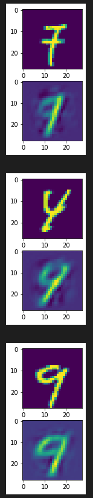

## image-sharpening

A test to see if I can sharpen images with an autoencoder. Currently has an autoencoder which can produce images given an input. Maybe an autoencoder isn't the best for sharpening but we'll see what we can do.

